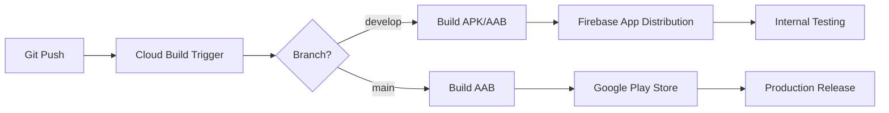

# Google Cloud Build CI/CD セットアップガイド

## 概要
Google Cloud Build を使用して Android アプリを自動ビルドし、Firebase App Distribution 経由でテスト配布、最終的に Google Play Store へ自動公開する CI/CD パイプラインの構築手順です。

## 前提条件
- Google Cloud プロジェクトの作成済み
- Firebase プロジェクトの作成済み
- Google Play Console アカウント作成済み
- アプリの初回手動アップロード完了

## セットアップ手順

### 1. Google Cloud の準備

#### 1.1 必要な API を有効化
```bash
# Cloud Build API
gcloud services enable cloudbuild.googleapis.com

# Secret Manager API（秘密情報管理用）
gcloud services enable secretmanager.googleapis.com

# Google Play Android Developer API
gcloud services enable androidpublisher.googleapis.com
```

#### 1.2 Secret Manager にシークレットを登録

```bash
# キーストアをSecret Managerに保存
gcloud secrets create android-keystore \
  --data-file=release.keystore

# キーストアのパスワードを保存
echo -n "your_keystore_password" | \
  gcloud secrets create keystore-password --data-file=-

# キーのパスワードを保存
echo -n "your_key_password" | \
  gcloud secrets create key-password --data-file=-

# google-services.json を保存
gcloud secrets create google-services-json \
  --data-file=app/google-services.json

# Firebase App ID を保存
echo -n "1:123456789:android:abcdef" | \
  gcloud secrets create firebase-app-id --data-file=-
```

### 2. Google Play Console の設定

#### 2.1 サービスアカウントの作成

1. Google Play Console にログイン
2. 「設定」→「API アクセス」へ移動
3. 「新しいサービスアカウントを作成」をクリック
4. Google Cloud Console で以下を実行：

```bash
# サービスアカウントを作成
gcloud iam service-accounts create play-console-deploy \
  --display-name="Google Play Console Deploy"

# キーを作成してダウンロード
gcloud iam service-accounts keys create play-console-key.json \
  --iam-account=play-console-deploy@${PROJECT_ID}.iam.gserviceaccount.com

# Secret Manager に保存
gcloud secrets create google-play-service-account \
  --data-file=play-console-key.json

# ローカルのキーファイルを削除
rm play-console-key.json
```

#### 2.2 Google Play Console での権限付与

1. Play Console の「API アクセス」ページに戻る
2. 作成したサービスアカウントを選択
3. 以下の権限を付与：
   - 「リリース管理」→「リリースの管理」
   - 「リリース管理」→「製品版リリースの管理」

### 3. Cloud Build の権限設定

```bash
# Cloud Build サービスアカウントに Secret Manager へのアクセス権限を付与
gcloud projects add-iam-policy-binding ${PROJECT_ID} \
  --member="serviceAccount:${PROJECT_NUMBER}@cloudbuild.gserviceaccount.com" \
  --role="roles/secretmanager.secretAccessor"
```

### 4. ビルドトリガーの設定

#### 4.1 GitHub リポジトリの接続

```bash
# Cloud Console UI から設定するか、以下のコマンドを使用
gcloud builds triggers create github \
  --repo-name="positive-converter" \
  --repo-owner="your-github-username" \
  --branch-pattern="^main$" \
  --build-config="cloudbuild.yaml" \
  --substitutions="_PACKAGE_NAME=com.positive.converter,_PLAY_TRACK=production"
```

#### 4.2 開発用ブランチのトリガー

```bash
# developブランチ用（Firebase App Distribution へ配布）
gcloud builds triggers create github \
  --repo-name="positive-converter" \
  --repo-owner="your-github-username" \
  --branch-pattern="^develop$" \
  --build-config="cloudbuild.yaml" \
  --substitutions="_PACKAGE_NAME=com.positive.converter,_PLAY_TRACK=internal"
```

### 5. Firebase App Distribution の設定

#### 5.1 Firebase プロジェクトとの連携

```bash
# Firebase CLI をインストール
npm install -g firebase-tools

# Firebase にログイン
firebase login

# プロジェクトを初期化
firebase init
# "Hosting" と "App Distribution" を選択
```

#### 5.2 テスターグループの作成

1. Firebase Console にアクセス
2. 「App Distribution」を選択
3. 「テスター」タブで「グループを作成」
4. "internal-testers" という名前でグループ作成
5. テスターのメールアドレスを追加

### 6. 手動ビルドの実行

```bash
# 手動でビルドを実行してテスト
gcloud builds submit \
  --config=cloudbuild.yaml \
  --substitutions=BRANCH_NAME=develop,SHORT_SHA=test123,_PACKAGE_NAME=com.positive.converter,_PLAY_TRACK=internal
```

## トラブルシューティング

### ビルドエラーの確認
```bash
# ビルドログを確認
gcloud builds log ${BUILD_ID}

# 最近のビルドをリスト
gcloud builds list --limit=5
```

### Secret Manager の権限エラー
```bash
# サービスアカウントの権限を確認
gcloud projects get-iam-policy ${PROJECT_ID} \
  --flatten="bindings[].members" \
  --filter="bindings.members:serviceAccount:*cloudbuild*"
```

### Google Play API エラー
- サービスアカウントが Play Console で承認されているか確認
- 初回は手動でアプリをアップロードする必要がある
- API が有効化されているか確認

## CI/CD フロー



## コスト見積もり

- **Cloud Build**: 120分/日まで無料、以降 $0.003/分
- **Secret Manager**: 6個まで無料、10,000アクセス/月まで無料
- **Cloud Storage**: 5GBまで無料（ビルド成果物保存用）

月間100ビルド程度なら、ほぼ無料枠内で運用可能です。

## セキュリティベストプラクティス

1. **キーストアの管理**
   - 絶対にリポジトリにコミットしない
   - Secret Manager で暗号化保存
   - 定期的にキーをローテーション

2. **サービスアカウント**
   - 最小権限の原則を適用
   - 定期的に権限を監査
   - 不要になったキーは削除

3. **ブランチ保護**
   - mainブランチへの直接プッシュを禁止
   - Pull Request 必須
   - コードレビュー必須

## 次のステップ

1. Slack/Discord への通知連携
2. 自動テストの統合
3. パフォーマンスモニタリング（Firebase Performance）
4. クラッシュレポート（Firebase Crashlytics）
5. A/B テスト機能の追加